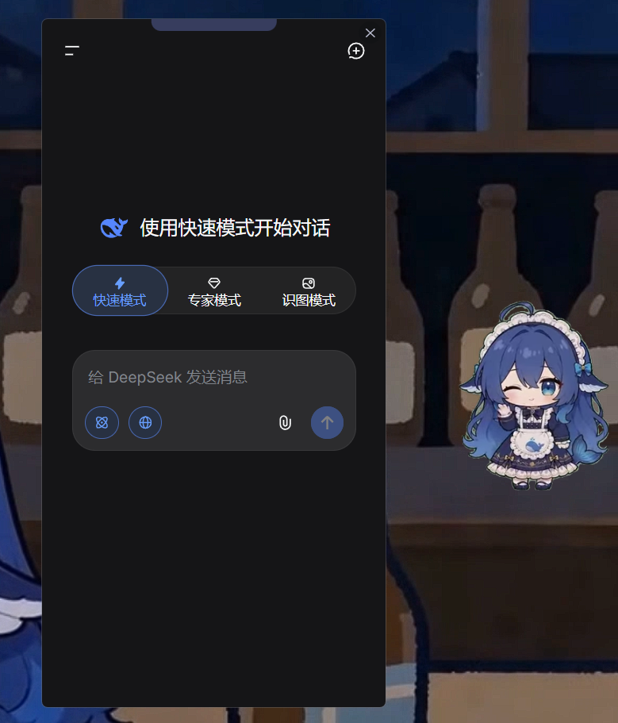

# DeepSeek Desktop

**DeepSeek Desktop** 是 [DeepSeek](https://chat.deepseek.com/) 的第三方 Windows 桌面客户端，在 Electron 壳基础上加入了**主窗口多标签对话 + 悬浮球/鲸鱼娘桌宠 + 前台感知**等实用功能。

## 借鉴说明

本项目在开发中参考/借鉴了以下开源项目，在此对原作者表示感谢：

| 项目 | 借鉴内容 |
|---|---|
| [doxdk/deepseek-desktop](https://github.com/doxdk/deepseek-desktop) | Electron 壳基础（本项目 fork 自该仓库） |
| [PC2005-cloud/dsh-pet](https://github.com/PC2005-cloud/dsh-pet) | 鲸鱼娘**动画素材**（51 个透明 webm，MIT 许可）+ **动画链模型**（双缓冲交叉淡入、概率链、命中区、拖拽手感） |
| [QCYTSN/dsh-dafeiyu](https://github.com/QCYTSN/dsh-dafeiyu) | **气泡思路**（轻量文字气泡，问候/提醒/台词） |
| [AnRkey/Grok-Desktop](https://github.com/AnRkey/Grok-Desktop) | **多标签页**、系统主题跟随、常置顶、模块化/快捷键/安全加固思路 |

---

## 截图

| 主窗口(多标签) | 鲸鱼娘桌宠（全量动画 + 台词气泡） | 托盘菜单 | 右键菜单 |
|:---:|:---:|:---:|:---:|
|  |  |  |  |

---

## 功能特性（v1.1.0）

### 主窗口（唯一对话入口，多标签）

- **多标签页** — 顶部标签栏，`Ctrl+T` 新建、`Ctrl+Tab` / `Ctrl+Shift+Tab` 切换、`×` 关闭（至少保留一个），多会话并行
- **启动即显示** — 默认屏幕居中；尺寸随档位联动（小=720p 800×600、中=1080p 960×720 / 1440p 1120×840、大=2160p 1280×960）
- **系统主题跟随** — 标签栏/菜单/气泡等本地 UI 随系统深浅色自动切换
- **主窗置顶** — 标签栏 📌 按钮一键切换（与托盘"主窗置顶"同步），**默认开启**
- **开机启动** — 首次启动自动设为开机启动（可托盘关闭）
- **截图提问** — 右键(悬浮球/托盘)"截图提问"→ 框选屏幕区域 → 自动打开主窗口并**粘贴截图到当前标签**的输入框
- **快捷键** — Ctrl+R 刷新当前标签 · Ctrl+W 隐藏 · Ctrl+T 新标签 · Ctrl+Tab 切换

### 桌宠：悬浮球 / 鲸鱼娘（托盘一键切换，状态记忆）

- **默认悬浮球**（新用户）；托盘可切换鲸鱼娘/关闭显示

- **鲸鱼娘** — 51 个全量动画（待机/转向/动作/移动/点击回应），动画链概率驱动，单击随时回应、双击开关主窗
- **入睡机制** — 交互闲置 60 秒自动入睡（原地小憩），点击/拖拽/状态变化唤醒
- **动作台词气泡** — 每个动画配台词（写代码="这个 bug 在哪…"、吃Token="嗯，这 Token 好吃!"、拖拽="喂喂，别拽我!"），随机变体；**10 秒冷却防轰炸**
- **趣味提醒气泡** — 启动问好 / 喝水（45 分钟）/ 久坐运动（30 分钟）/ 饭点前提醒（7:30·11:30·17:30）/ 夜间休息（23 点）/ 随机感叹
- **尺寸三档** — 托盘"尺寸"可选 小/中/大，桌宠与主窗口同步缩放（悬浮球 40/48/56px，鲸鱼娘 220×124/300×169/400×225）
- **前台感知开关**（默认开）— 全屏自动隐藏（看视频/游戏不遮挡）+ 按前台程序类型适配动画（焦点在 DeepSeek 吐泡泡、IDE 里多演"写代码"、游戏里"气急败坏"…）；关闭则完全不读取前台窗口
- **对话状态徽标** — 悬浮球焦点在 DeepSeek 时显示蓝点呼吸

### 其他

- **自动更新** — 托盘检查更新，后台下载后一键重启安装

---

## 安装

### 下载安装包

[**下载 DeepSeek Desktop 安装包 (Windows)**](https://github.com/xmbl4399/deepseek-desktop/releases)

### 从源码构建

```bash
git clone https://github.com/xmbl4399/deepseek-desktop.git
cd deepseek-desktop
npm install
npm start        # 开发模式运行
npm test         # 冒烟测试
npm run build    # 打包安装包
```

---

## 系统要求

- Windows 10 或更高版本

---

## 致谢

- [doxdk/deepseek-desktop](https://github.com/doxdk/deepseek-desktop) — Electron 壳基础
- [PC2005-cloud/dsh-pet](https://github.com/PC2005-cloud/dsh-pet) — 鲸鱼娘动画素材与动画链模型（MIT）
- [QCYTSN/dsh-dafeiyu](https://github.com/QCYTSN/dsh-dafeiyu) — 气泡思路
- [AnRkey/Grok-Desktop](https://github.com/AnRkey/Grok-Desktop) — 多标签页、主题、常置顶思路

---

## 许可证

MIT License
