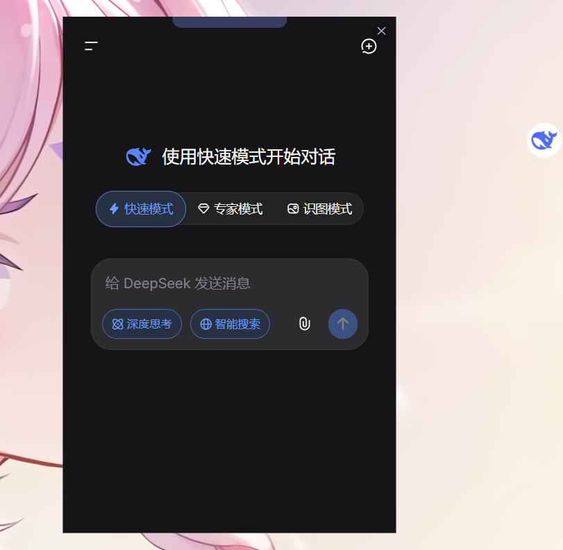
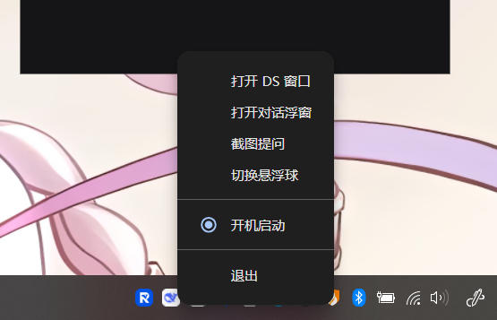
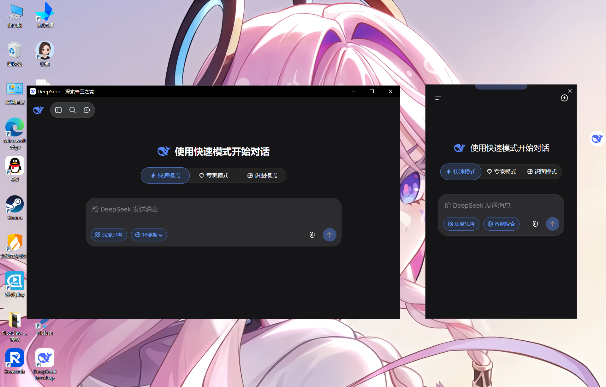

# DeepSeek Desktop

**DeepSeek Desktop** 是 [DeepSeek](https://chat.deepseek.com/) 的第三方桌面客户端，在原有 Electron 壳基础上做了一些实用改进。

> 本项目 fork 自 [doxdk/deepseek-desktop](https://github.com/doxdk/deepseek-desktop)，在此对原作者表示感谢。

---

## 截图

| 悬浮球 + 对话浮窗 | 托盘菜单 | 右键菜单 |
|:---:|:---:|:---:|
|  |  |  |

---

## 相比原项目的新增功能

- **悬浮球拖拽优化** — 可直接拖动悬浮球 logo 移动位置，去掉独立把手，紧贴屏幕边缘不超出
- **对话小浮窗** — 单击悬浮球弹出独立对话窗口，固定在屏幕右侧，支持上传图片/文件
- **右键自绘菜单** — 悬浮球右键弹出紧凑菜单（打开 DS 窗口 / 对话浮窗 / 截图提问 / 切换悬浮球），菜单窗口自适应内容宽度
- **托盘菜单增强** — 加入开机启动开关、菜单项顺序和命名优化
- **默认启动浮层** — 双击桌面图标启动后自动弹出对话浮窗，不显示主窗口
- **主窗口按需加载** — 启动不创建主窗口，双击悬浮球或托盘菜单才打开，减少资源占用
- **截图提问** — 支持区域截图后直接粘贴到对话中提问
- **Windows DPI 适配** — 125% 缩放比例下正常使用
- **图标统一** — 托盘、任务栏、悬浮球全部使用 DeepSeek 官方 logo

---

## 安装

### 下载安装包

[**下载 DeepSeek Desktop 安装包 (Windows)**](https://github.com/xmbl4399/deepseek-desktop/releases)

### 从源码构建

```bash
git clone https://github.com/xmbl4399/deepseek-desktop.git
cd deepseek-desktop
npm install
npm start        # 开发模式运行
npm run build    # 打包安装包
```

---

## 系统要求

- Windows 10 或更高版本

---

## 致谢

感谢原项目 [doxdk/deepseek-desktop](https://github.com/doxdk/deepseek-desktop) 提供的 Electron 壳基础。

---

## 许可证

MIT License
